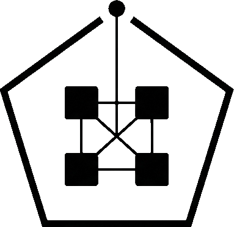
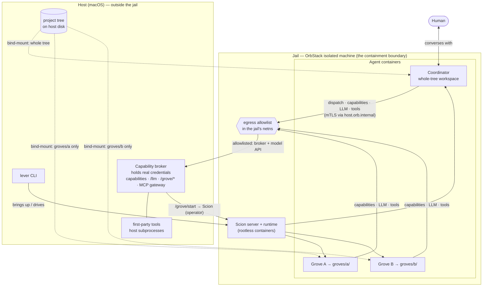

<p align="center">
  
</p>

# Lever

Homepage: **[lever.to](https://lever.to)**

**Containerised, jailed multi-agent orchestration.** Lever lets a single *manager* agent (the
coordinator) drive a fleet of *grove* agents that do real work, each in its own isolated container,
while the whole stack runs inside a **jail** designed so that a compromised or prompt-injected agent
cannot read host secrets or reach your local network.

Lever is the **orchestration and interface layer**; [Scion](https://github.com/GoogleCloudPlatform/scion) is
the **runtime engine** underneath (containers, sessions, attach/resume, typed messaging). You talk
to one tool, `lever`, and it drives Scion for you.

> **Status (v0.2.0): working, builds from source; not yet packaged/released.** A manager boots in the
> jail, edits a bind-mounted tree in place, dispatches grove agents, and reaches capability-gated
> tools through the broker's mTLS gateway — real credentials never enter a container — all
> **live-validated on macOS + OrbStack**. `lever stop`/`up` preserve the manager's conversation across
> a power-off. No installer yet (build from source: `make all` + `make lever-image`); **Linux is being
> proven** (Lima passes its macOS e2e). See [Where this is today](#where-this-is-today).

## Why

LLM agents that run autonomous tool-call loops are powerful and dangerous in the same breath. The
moment an agent processes untrusted content, a web page, a dependency, an issue comment, it can
be steered. If that agent runs on your machine with your filesystem and your network, "steered"
means *your SSH keys and your LAN*.

Lever's answer is not "trust the agent." It is **assume the agent is hostile and let the OS contain
it.** The intended bound is a single directory subtree and a curated set of network endpoints,
enforced by the operating system, not by the agent behaving. (What that bound does and does *not*
cover, e.g. data exfiltration over allowed internet egress, is spelled out in the
[security model](docs-site/_guides/security-model.md).)

## The model in one paragraph

A **project is just a directory.** You register a directory with Lever and every agent working on
it gets that directory bind-mounted, live, in place, no clones, no sync. One special project is
the **manager**, whose workspace is the whole tree; every other project is a **grove** (a project
directory an agent works in), isolated from the manager and from its siblings. The manager
dispatches work to groves, watches a typed event stream for progress and questions, and is the
single thing a human talks to.



## How it stays contained

The runtime and every agent run inside **one jail**, an [OrbStack](https://orbstack.dev) *isolated
machine*: a Linux guest that, unlike a normal machine, shares **none** of the host's files and has
its own network namespace by default. The `lever` operator binary and Lever's **capability broker**
(which holds your real credentials) run on the host; Scion's server and runtime broker, the
container runtime, and all agents run *inside* the jail. The jail mounts only the project tree you
choose and cannot route to your LAN. Inside it, agents run as
rootless containers. The result the design targets:

- **Filesystem:** host secrets (`~/.ssh`, cloud creds) are *not in the environment*, so they cannot
  be mounted or read, even by the orchestrator.
- **Network:** the LAN is unreachable; only an explicit allowlist of endpoints (the model API and
  chosen local tool ports, e.g. MCP, the Model Context Protocol) is permitted.

No fork of the runtime is required, the containment is enforced from outside it. Full detail,
caveats, and the validation evidence are in [security model](docs-site/_guides/security-model.md).

**The jail is a VM-isolation contract, not a container runtime.** OrbStack is the reference
implementation; `lima` (macOS/Linux, its own VM kernel) is the second, both selectable today.
Apple's per-agent-VM `container` is on the roadmap; each declares its own guarantees (`lever
backends`, or the [containment backends](docs-site/_reference/backends.md) matrix). Docker Desktop
is *not* an implementation, its shared VM auto-mounts your home directory and its network namespace
is not yours to control, so it cannot provide the boundary; a native, no-VM Linux backend was
explored and rejected on the mirror-image ground (no VM at all) — see the backends page.

## Core + instance

`lever.to` ships the **generic core**: the orchestration engine, the manager *runtime/role*, the
jail provisioning, the project model, and these docs. Your own setup is an **instance** built on
top, your own knowledge base, your own tools, your own groves, and the manager's prompt/skills/tool
config, consuming the `lever` binary as a dependency. The framework authors run their personal
assistant as the first instance (dogfooding). See [core vs instance](docs-site/_guides/core-vs-instance.md).

## Where this is today

- **Done:** the jail (isolated machine + rootless podman + egress allowlist); host `lever` + in-jail
  `lever-manager`; `lever apply`/`up`, with the manager editing a bind-mounted tree in place and
  dispatching groves. The **capability broker** (mTLS gateway, short-lived identity-bound tokens;
  first-party + external MCP tools gated; api-key mode keeps the real key out of every container;
  `lever revoke` is terminal). `lever init`/`reload`/`doctor`; `stop`/`up` preserve the conversation.
  `make lever-image`; two runnable examples — [hello-grove](examples/hello-grove) and
  [assistant-demo](examples/assistant-demo) (live-proven in the jail 2026-07-05). The **Lima** backend
  passes its macOS acceptance gate.
- **Being proven:** Linux (Lima's QEMU/KVM path — needs a real KVM-capable host).
- **Not yet:** a release/installer; an asciinema walkthrough; deeper `lever doctor` probes.
- **You can today:** `make all` + `make lever-image`, `lever apply`/`up`, dispatch groves with
  capability-gated tools, run the examples. Docs:
  [getting-started](docs-site/_guides/getting-started.md), [capabilities](docs-site/_guides/capabilities.md),
  [operations](docs-site/_guides/operations.md), [CLI](docs-site/_reference/cli.md),
  [architecture](docs-site/_guides/architecture.md), [security model](docs-site/_guides/security-model.md).

## Build & run

There are **two binaries** (one shared `internal/`):

- **`lever`**, the host *control plane* (provisioning + lifecycle). Runs on your machine.
- **`lever-manager`**, the in-jail *orchestrator* (`agent`/`msg`/`watch`). Cross-compiled for the
  jail's linux/arm64 by `make lever-image-bins` and baked into the agent image (your Dockerfile
  `COPY`s it to `/usr/local/bin`). The manager runs it to dispatch and steer groves.

```bash
make install              # build host `lever` → ~/.local/bin/lever (must be on PATH). Requires Go 1.26+
make all                  # same (the in-jail binaries ship in the agent image, via lever-image-bins)

# Bring an application up (jail + scion + manager) and attach the manager TTY.
# Run from the instance root (where lever.yaml lives, resolved from cwd, no walk-up):
cd path/to/my-instance && lever up

# …or pass an explicit config path from anywhere:
lever up path/to/my-instance/lever.yaml

# Headless (bring up, don't attach):
lever apply
lever apply --dry-run                     # print the bring-up plan only
```

Build the agent image (`scionlocal/lever-claude:latest`, loaded into the jail) with `make
lever-image` — it cross-compiles the in-jail binaries and builds `FROM` scion's stock
`scion-claude:latest` (build that once from a [scion](https://github.com/GoogleCloudPlatform/scion)
checkout: `image-build/scripts/build-images.sh --target harnesses`). Instances that need extra
tooling extend the image with their own Dockerfile `FROM lever-claude:latest`.

Overrides: `make install PREFIX=/some/bin`, `make lever-image LEVER_IMAGE_ARCH=amd64`,
`make lever-image-bins LEVER_IMAGE_CTX=/path/to/image-context` (stage bins into an instance dir).

An **application** is one config file describing the manager + its groves (image, project tree,
scion source, credential, allowed host ports). The canonical filename is **`lever.yaml`** at the
instance **root**, which is *not* mounted, only the `tree:` subdirectory is bind-mounted into the
jail (so the config and boot prompt stay out of the agent-writable mount). Commands with no config
argument read `./lever.yaml` from the current directory; there is **no walk-up discovery** (run from
the root, or pass an explicit path). See `examples/` for runnable configs and
[config reference](docs-site/_reference/config.md) for every key.

## Commands

**Host `lever` (control plane):**

| Command | What it does |
|---|---|
| `lever up [config]` | Bring the application up *if needed* (create jail, provision scion, start the manager) **and attach** the manager's TTY. Reads `./lever.yaml` from cwd when omitted (no walk-up). `--fresh` starts a new manager thread; `--no-attach` brings up without attaching. The everyday entry point. |
| `lever apply [config]` | Headless bring-up, runs the full plan (jail → images → scion init/config/server → credential → register manager + groves → mint bootstrap → start manager). No attach. `--dry-run` prints the plan and exits. |
| `lever provision` | Low-level: provision the jail only (create the isolated machine, install runtimes + scion, apply egress). `--machine`, `--tree`, `--allow-port`. Rarely needed directly. |
| `lever reload [config]` | Apply config changes to a **running** instance without a VM power cycle: restarts the broker on the current config (re-registers groves, re-applies egress) while leaving the manager container running, so its conversation is preserved. Needed because the broker reads `lever.yaml` only at startup. |
| `lever attach [name]` | Attach your TTY to the manager (default) or a named grove. Strictly passive: fails fast with "run `lever up` first" if the jail isn't up. |
| `lever msg send "…" --to NAME` | Host-side fire-and-forget note to the manager (app name) or a declared grove — no attach needed; the agent picks it up as its next user turn. `--interrupt` injects it ahead of the agent's next turn. Strictly passive like `attach`. |
| `lever init` | Scaffold/refresh the framework operator skills (SKILL.md) into the instance tree — `lever-operator` at the tree root, `lever-agent` in each grove dir — plus a marked reference block in the tree-root CLAUDE.md. Hash-guarded: your edited copies are left alone with a warning (`--force` overwrites); `--check` reports staleness without writing. Re-run after upgrading lever or adding a grove. |
| `lever stop` | Power the jail off but **keep its disk** (`orb stop`) — the daily "done for the day". Suspends the manager, stops the host broker; a later `lever up` powers it back on and resumes. Everything (installed runtimes, scion state) persists. |
| `lever destroy` | Full teardown: delete the isolated machine and everything in it (`orb delete`). Targets `lever-<name>` from config; override with `--machine`. `lever down` is a deprecated alias. |
| `lever doctor` | Diagnose the setup (broker alive, external tool backends reachable, credential file, scion registration, `.mcp.json`-in-tree, Go toolchain, operator-skills scaffold current); each failing check prints the fix. Targets `lever-<name>` from config; override with `--machine`. |
| `lever version` | Print the version. |

**In-jail `lever-manager` (orchestration, run by the manager inside the container):**

| Command | What it does |
|---|---|
| `lever-manager agent <list\|start\|stop\|suspend\|resume> NAME` | Grove lifecycle, routed through the capability broker. Dispatch a grove with `agent start NAME --task "…"`, where NAME is a grove declared in the config; the broker authenticates the call, validates the name, and resolves the grove's image and workspace from the config before starting it (`--image` overrides). |
| `lever-manager msg send --to GROVE "…"` / `lever-manager msg list` | Send a message to a running agent / read the typed agent-event inbox (`scion notifications`). |
| `lever-manager watch` | Stream scion events to a file the manager `Monitor`s (the notification bridge). |
| `lever-manager version` | Print the version. |

`lever up` is the muscle-memory entry; `apply` is its non-interactive half for scripts/scheduled
runs. Both are idempotent, re-running `up` resumes a suspended manager and re-attaches.

## Requirements (intended)

- macOS on Apple Silicon with [OrbStack](https://orbstack.dev) (the validated host today), or
  [Lima](https://lima-vm.io) (macOS or Linux, its own VM kernel; requires Lima ≥ 2.0.0) as the
  non-OrbStack backend. See [containment backends](docs-site/_reference/backends.md).
- [Scion](https://github.com/GoogleCloudPlatform/scion) as the runtime engine.
- An LLM coding-agent harness (e.g. an OAuth-authenticated Claude Code).

## Documentation

- [Getting started](docs-site/_guides/getting-started.md), build and run a working instance from scratch (worked example).
- [Config reference](docs-site/_reference/config.md), every `lever.yaml` key, defaults, and conventions.
- [Architecture](docs-site/_guides/architecture.md), topology, components, the dispatch/notification loop, the project model.
- [Security model](docs-site/_guides/security-model.md), threat model, the jail, what containment does and does not buy, validation evidence.
- [Core vs instance](docs-site/_guides/core-vs-instance.md), the boundary, and how an instance is built on the core.
- [Conventions](docs-site/_guides/conventions.md), recommended (not enforced) patterns, shown via the reference instance.

## Licence

[MIT](LICENSE) © Stephen Ierodiaconou.
