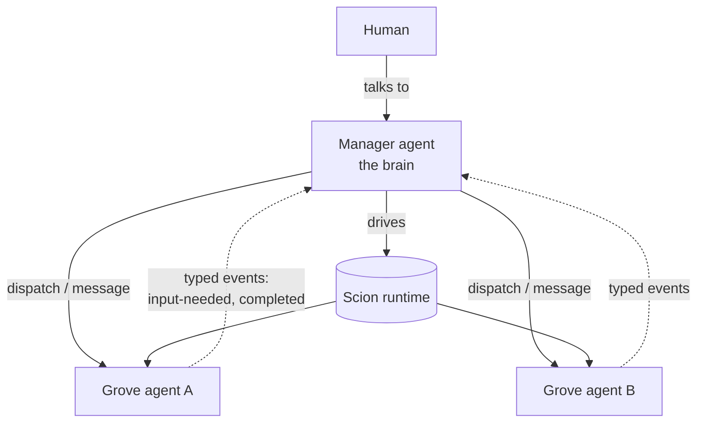

# Lever

Homepage: **[lever.to](https://lever.to)**

**Containerised, jailed multi-agent orchestration.** Lever lets a single *manager* agent (the
brain) drive a fleet of *grove* agents that do real work, each in its own isolated container,
while the whole stack runs inside a **jail** designed so that a compromised or prompt-injected agent
cannot read host secrets or reach your local network.

Lever is the **brain and the interface**; [Scion](https://github.com/GoogleCloudPlatform/scion) is
the **runtime engine** underneath (containers, sessions, attach/resume, typed messaging). You talk
to one tool, `lever`, and it drives Scion for you.

> **Status: working, builds from source; not yet packaged/released.** Two binaries build from
> source, host `lever` (control plane) + in-jail `lever-manager` (orchestration), and bring a
> manager up end-to-end in the jail, then let it **dispatch grove agents**, all **live-validated on
> macOS + OrbStack** (Apple Silicon): isolated machine + rootless podman + egress allowlist, the
> manager editing a bind-mounted project tree in place with hub state-tracking, dispatching a sibling
> grove, relaying its question back, and closing a task on completion. There is no release/install
> yet (you build it, `make install`), and some polish (tidier MCP wiring, per-step progress) is in
> progress. See [Where this is today](#where-this-is-today).

## Why

LLM agents that run autonomous tool-call loops are powerful and dangerous in the same breath. The
moment an agent processes untrusted content, a web page, a dependency, an issue comment, it can
be steered. If that agent runs on your machine with your filesystem and your network, "steered"
means *your SSH keys and your LAN*.

Lever's answer is not "trust the agent." It is **assume the agent is hostile and let the OS contain
it.** The intended bound is a single directory subtree and a curated set of network endpoints,
enforced by the operating system, not by the agent behaving. (What that bound does and does *not*
cover, e.g. data exfiltration over allowed internet egress, is spelled out in the
[security model](docs-site/_guides/security-model.md).)

## The model in one paragraph

A **project is just a directory.** You register a directory with Lever and every agent working on
it gets that directory bind-mounted, live, in place, no clones, no sync. One special project is
the **manager**, whose workspace is the whole tree; every other project is a **grove** (a project
directory an agent works in), isolated from the manager and from its siblings. The manager
dispatches work to groves, watches a typed event stream for progress and questions, and is the
single thing a human talks to.



## How it stays contained

The runtime and every agent run inside **one jail**, an [OrbStack](https://orbstack.dev) *isolated
machine*: a Linux guest that, unlike a normal machine, shares **none** of the host's files and has
its own network namespace by default. The `lever` operator binary runs on the host and drives into
the jail; the Scion server/broker, the container runtime, and all agents run *inside* it. The jail
mounts only the project tree you choose and cannot route to your LAN. Inside it, agents run as
rootless containers. The result the design targets:

- **Filesystem:** host secrets (`~/.ssh`, cloud creds) are *not in the environment*, so they cannot
  be mounted or read, even by the orchestrator.
- **Network:** the LAN is unreachable; only an explicit allowlist of endpoints (the model API and
  chosen local tool ports, e.g. MCP, the Model Context Protocol) is permitted.

No fork of the runtime is required, the containment is enforced from outside it. Full detail,
caveats, and the validation evidence are in [security model](docs-site/_guides/security-model.md).

## Core + instance

`lever.to` ships the **generic core**: the orchestration engine, the manager *runtime/role*, the
jail provisioning, the project model, and these docs. Your own setup is an **instance** built on
top, your own knowledge base, your own tools, your own groves, and the manager's prompt/skills/tool
config, consuming the `lever` binary as a dependency. The framework authors run their personal
assistant as the first instance (dogfooding). See [core vs instance](docs-site/_guides/core-vs-instance.md).

## Where this is today

- **Done:** architecture + security model; containment primitives validated by hand; the host `lever`
  + in-jail `lever-manager` binaries; `lever apply` (config-driven bring-up) and `lever up` (bring-up +
  attach); live end-to-end validation on macOS + OrbStack, a manager boots in the jail, edits a
  bind-mounted tree **in place**, the hub tracks it (heartbeats, attach), and **the manager dispatches
  a grove agent, relays its question back, and closes a task on completion** (proven 2026-06-17).
- **In progress:** tidier MCP wiring; per-step bring-up progress; load a grove image at apply time;
  broader substrate support (Linux/Docker backend); packaging.
- **Not yet:** a release/installer. Build from source (`make install`).
- **You can today:** build the binaries (`make all`) and bring an app up with `lever apply` / `lever up`,
  then have the manager dispatch groves; read
  the [architecture](docs-site/_guides/architecture.md) and [security model](docs-site/_guides/security-model.md).

## Build & run

There are **two binaries** (one shared `internal/`):

- **`lever`**, the host *control plane* (provisioning + lifecycle). Runs on your machine.
- **`lever-manager`**, the in-jail *orchestrator* (`agent`/`msg`/`watch`). Cross-compiled for the
  jail's linux/arm64 and staged into the instance tree, which is bind-mounted into the manager
  container. The manager runs it to dispatch and steer groves.

```bash
make install              # build host `lever` → ~/.local/bin/lever (must be on PATH). Requires Go 1.26+
make lever-manager-linux  # cross-compile `lever-manager` → $LEVER_INSTANCE/vendor/bin (set LEVER_INSTANCE)
make all                  # both

# Bring an application up (jail + scion + manager) and attach the manager TTY.
# Run from the instance root (where lever.yaml lives, resolved from cwd, no walk-up):
cd path/to/my-instance && lever up

# …or pass an explicit config path from anywhere:
lever up path/to/my-instance/lever.yaml

# Headless (bring up, don't attach):
lever apply
lever apply --dry-run                     # print the bring-up plan only
```

Overrides: `make install PREFIX=/some/bin`, `make lever-manager-linux LEVER_INSTANCE=/path/to/instance`.

An **application** is one config file describing the manager + its groves (image, project tree,
scion source, credential, allowed host ports). The canonical filename is **`lever.yaml`** at the
instance **root**, which is *not* mounted, only the `tree:` subdirectory is bind-mounted into the
jail (so the config and boot prompt stay out of the agent-writable mount). Commands with no config
argument read `./lever.yaml` from the current directory; there is **no walk-up discovery** (run from
the root, or pass an explicit path). See `examples/` for runnable configs and
[config reference](docs-site/_reference/config.md) for every key.

## Commands

**Host `lever` (control plane):**

| Command | What it does |
|---|---|
| `lever up [config]` | Bring the application up *if needed* (create jail, provision scion, start the manager) **and attach** the manager's TTY. Reads `./lever.yaml` from cwd when omitted (no walk-up). `--fresh` starts a new manager thread; `--no-attach` brings up without attaching. The everyday entry point. |
| `lever apply [config]` | Headless bring-up, runs the full plan (jail → images → scion init/config/server → credential → register manager + groves → mint bootstrap → start manager). No attach. `--dry-run` prints the plan and exits. |
| `lever provision` | Low-level: provision the jail only (create the isolated machine, install runtimes + scion, apply egress). `--machine`, `--tree`, `--allow-port`. Rarely needed directly. |
| `lever down` | Tear the jail down (removes the isolated machine and everything in it). Targets `lever-<name>` from the discovered config; override with `--machine`. |
| `lever doctor` | Diagnose the setup (machine up, image registry, hub health, a credential available); each failing check prints the fix. Targets `lever-<name>` from config; override with `--machine`. |
| `lever version` | Print the version. |

**In-jail `lever-manager` (orchestration, run by the manager inside the container):**

| Command | What it does |
|---|---|
| `lever-manager agent <list\|start\|stop\|suspend\|resume> NAME` | Grove lifecycle, routed through the capability broker. Dispatch a grove with `agent start NAME --task "…"`, where NAME is a grove declared in the config; the broker authenticates the call, validates the name, and resolves the grove's image and workspace from the config before starting it (`--image` overrides). |
| `lever-manager msg send --to GROVE "…"` / `lever-manager msg list` | Send a message to a running agent / read the typed agent-event inbox (`scion notifications`). |
| `lever-manager watch` | Stream scion events to a file the manager `Monitor`s (the notification bridge). |
| `lever-manager version` | Print the version. |

`lever up` is the muscle-memory entry; `apply` is its non-interactive half for scripts/scheduled
runs. Both are idempotent, re-running `up` resumes a suspended manager and re-attaches.

## Requirements (intended)

- macOS on Apple Silicon with [OrbStack](https://orbstack.dev) (the validated host today; a
  dedicated VM such as Lima/Colima is a planned alternative substrate).
- [Scion](https://github.com/GoogleCloudPlatform/scion) as the runtime engine.
- An LLM coding-agent harness (e.g. an OAuth-authenticated Claude Code).

## Documentation

- [Getting started](docs-site/_guides/getting-started.md), build and run a working instance from scratch (worked example).
- [Config reference](docs-site/_reference/config.md), every `lever.yaml` key, defaults, and conventions.
- [Architecture](docs-site/_guides/architecture.md), topology, components, the dispatch/notification loop, the project model.
- [Security model](docs-site/_guides/security-model.md), threat model, the jail, what containment does and does not buy, validation evidence.
- [Core vs instance](docs-site/_guides/core-vs-instance.md), the boundary, and how an instance is built on the core.
- [Conventions](docs-site/_guides/conventions.md), recommended (not enforced) patterns, shown via the reference instance.

## Licence

[MIT](LICENSE) © Stephen Ierodiaconou.
