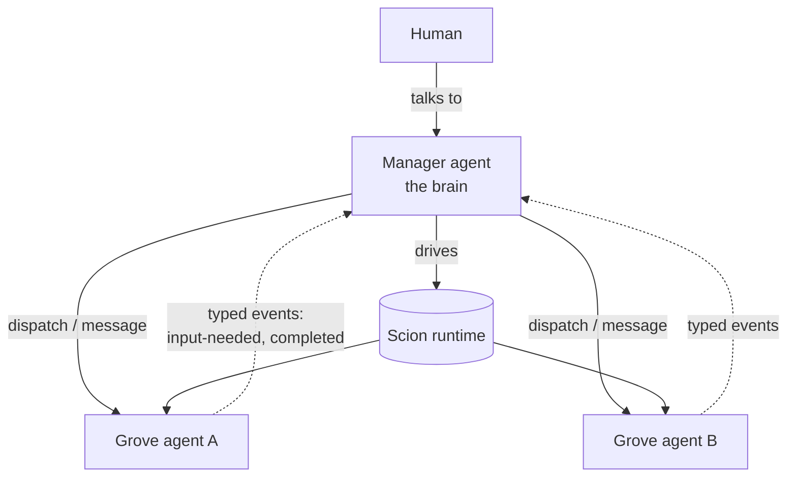

# Lever

**Containerised, jailed multi-agent orchestration.** Lever lets a single *manager* agent (the
brain) drive a fleet of *grove* agents that do real work — each in its own isolated container —
while the whole stack runs inside a **jail** designed so that a compromised or prompt-injected agent
cannot read host secrets or reach your local network.

Lever is the **brain and the interface**; [Scion](https://github.com/GoogleCloudPlatform/scion) is
the **runtime engine** underneath (containers, sessions, attach/resume, typed messaging). You talk
to one tool — `lever` — and it drives Scion for you.

> **Status: working, builds from source; not yet packaged/released.** The Go `lever` binary builds
> and `lever apply` brings a manager up end-to-end in the jail — **live-validated on macOS + OrbStack**
> (Apple Silicon): isolated machine + rootless podman + egress allowlist, the manager editing a
> bind-mounted project tree in place, with hub state-tracking. There is no release/install yet (you
> build it: `go build -o lever ./cmd/lever`), and some features (grove dispatch by the manager,
> tidier MCP wiring) are in progress. See [Where this is today](#where-this-is-today).

## Why

LLM agents that run autonomous tool-call loops are powerful and dangerous in the same breath. The
moment an agent processes untrusted content — a web page, a dependency, an issue comment — it can
be steered. If that agent runs on your machine with your filesystem and your network, "steered"
means *your SSH keys and your LAN*.

Lever's answer is not "trust the agent." It is **assume the agent is hostile and let the OS contain
it.** The intended bound is a single directory subtree and a curated set of network endpoints —
enforced by the operating system, not by the agent behaving. (What that bound does and does *not*
cover — e.g. data exfiltration over allowed internet egress — is spelled out in the
[security model](docs/security-model.md).)

## The model in one paragraph

A **project is just a directory.** You register a directory with Lever and every agent working on
it gets that directory bind-mounted, live, in place — no clones, no sync. One special project is
the **manager**, whose workspace is the whole tree; every other project is a **grove** (a project
directory an agent works in), isolated from the manager and from its siblings. The manager
dispatches work to groves, watches a typed event stream for progress and questions, and is the
single thing a human talks to.



## How it stays contained

The runtime and every agent run inside **one jail** — an [OrbStack](https://orbstack.dev) *isolated
machine*: a Linux guest that, unlike a normal machine, shares **none** of the host's files and has
its own network namespace by default. The `lever` operator binary runs on the host and drives into
the jail; the Scion server/broker, the container runtime, and all agents run *inside* it. The jail
mounts only the project tree you choose and cannot route to your LAN. Inside it, agents run as
rootless containers. The result the design targets:

- **Filesystem:** host secrets (`~/.ssh`, cloud creds) are *not in the environment*, so they cannot
  be mounted or read — even by the orchestrator.
- **Network:** the LAN is unreachable; only an explicit allowlist of endpoints (the model API and
  chosen local tool ports — e.g. MCP, the Model Context Protocol) is permitted.

No fork of the runtime is required — the containment is enforced from outside it. Full detail,
caveats, and the validation evidence are in [docs/security-model.md](docs/security-model.md).

## Core + instance

`lever.to` ships the **generic core**: the orchestration engine, the manager *runtime/role*, the
jail provisioning, the project model, and these docs. Your own setup is an **instance** built on
top — your own knowledge base, your own tools, your own groves, and the manager's prompt/skills/tool
config — consuming the `lever` binary as a dependency. The framework authors run their personal
assistant as the first instance (dogfooding). See [docs/core-vs-instance.md](docs/core-vs-instance.md).

## Where this is today

- **Done:** architecture + security model; containment primitives validated by hand; the Go `lever`
  binary; `lever apply` (config-driven bring-up) and `lever up` (bring-up + attach); live end-to-end
  validation on macOS + OrbStack — a manager boots in the jail, edits a bind-mounted tree **in place**,
  and the hub tracks it (heartbeats, attach).
- **In progress:** grove dispatch *by* the manager (needs orchestration tooling in the manager image);
  tidier MCP wiring; broader substrate support (Linux/Docker backend); packaging.
- **Not yet:** a release/installer. Build from source (below).
- **You can today:** `go build` the binary and bring an app up with `lever apply` / `lever up`; read
  the [architecture](docs/architecture.md) and [security model](docs/security-model.md).

## Build & run

```bash
go build -o lever ./cmd/lever        # requires Go 1.26+

# Bring an application up (jail + scion + manager) and attach the manager TTY:
./lever up path/to/app.yaml

# Or headless (bring up, don't attach):
./lever apply path/to/app.yaml
./lever apply path/to/app.yaml --dry-run   # print the bring-up plan only
```

An **application** is one `app.yaml` describing the manager + its groves (image, project tree,
scion source, credential, allowed host ports). See `examples/` for runnable configs and the
reference instance for a real one.

## Commands

| Command | What it does |
|---|---|
| `lever up <app.yaml>` | Bring the application up *if needed* (create jail, provision scion, start the manager) **and attach** the manager's TTY. `--fresh` starts a new manager thread; `--no-attach` brings up without attaching. The everyday entry point. |
| `lever apply <app.yaml>` | Headless bring-up — runs the full plan (jail → image → scion init/config/server → credential → register manager + groves → start manager). No attach. `--dry-run` prints the plan and exits. |
| `lever provision` | Low-level: provision the jail only (create the isolated machine, install runtimes + scion, apply egress). `--machine`, `--tree`, `--allow-port`. Rarely needed directly. |
| `lever down` | Tear the jail down (removes the isolated machine and everything in it). |
| `lever doctor` | Diagnose the setup (machine up, image registry, hub health, a credential available); each failing check prints the fix. |
| `lever agent <new\|list\|start\|attach\|suspend\|resume\|stop> NAME` | Grove/agent lifecycle against a running stack. |
| `lever msg send --to GROVE "…"` / `lever msg list` | Send a message to a running agent / read the typed agent-event inbox. |
| `lever watch` | Stream scion events (for a notification bridge). |
| `lever version` | Print the version. |

`lever up` is the muscle-memory entry; `apply` is its non-interactive half for scripts/scheduled
runs. Both are idempotent — re-running `up` resumes a suspended manager and re-attaches.

## Requirements (intended)

- macOS on Apple Silicon with [OrbStack](https://orbstack.dev) (the validated host today; a
  dedicated VM such as Lima/Colima is a planned alternative substrate).
- [Scion](https://github.com/GoogleCloudPlatform/scion) as the runtime engine.
- An LLM coding-agent harness (e.g. an OAuth-authenticated Claude Code).

## Documentation

- [Architecture](docs/architecture.md) — topology, components, the dispatch/notification loop, the project model.
- [Security model](docs/security-model.md) — threat model, the jail, what containment does and does not buy, validation evidence.
- [Core vs instance](docs/core-vs-instance.md) — the boundary, and how an instance is built on the core.
- [Conventions](docs/conventions.md) — recommended (not enforced) patterns, shown via the reference instance.

## Licence

Open source; specific licence to be finalised (MIT/Apache-2.0 intended).
