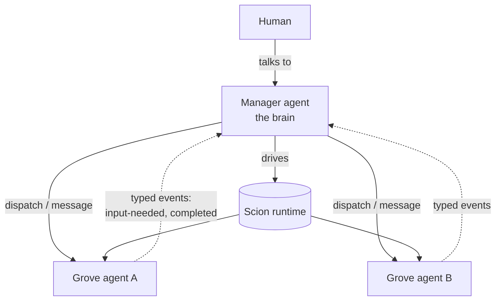

# Lever

**Containerised, jailed multi-agent orchestration.** Lever lets a single *manager* agent (the
brain) drive a fleet of *grove* agents that do real work — each in its own isolated container —
while the whole stack runs inside a **jail** designed so that a compromised or prompt-injected agent
cannot read host secrets or reach your local network.

Lever is the **brain and the interface**; [Scion](https://github.com/GoogleCloudPlatform/scion) is
the **runtime engine** underneath (containers, sessions, attach/resume, typed messaging). You talk
to one tool — `lever` — and it drives Scion for you.

> **Status: design + hand-validated containment. Nothing is installable yet.** The architecture and
> the *containment primitives* have been validated end-to-end by hand on macOS + OrbStack
> (filesystem isolation, network egress, rootless Docker, the runtime). The full integrated system
> test and the Go `lever` binary are **in progress** — so the runtime behaviours described in these
> docs are *designed, not yet shipped*. See [Where this is today](#where-this-is-today).

## Why

LLM agents that run autonomous tool-call loops are powerful and dangerous in the same breath. The
moment an agent processes untrusted content — a web page, a dependency, an issue comment — it can
be steered. If that agent runs on your machine with your filesystem and your network, "steered"
means *your SSH keys and your LAN*.

Lever's answer is not "trust the agent." It is **assume the agent is hostile and let the OS contain
it.** The intended bound is a single directory subtree and a curated set of network endpoints —
enforced by the operating system, not by the agent behaving. (What that bound does and does *not*
cover — e.g. data exfiltration over allowed internet egress — is spelled out in the
[security model](docs/security-model.md).)

## The model in one paragraph

A **project is just a directory.** You register a directory with Lever and every agent working on
it gets that directory bind-mounted, live, in place — no clones, no sync. One special project is
the **manager**, whose workspace is the whole tree; every other project is a **grove** (a project
directory an agent works in), isolated from the manager and from its siblings. The manager
dispatches work to groves, watches a typed event stream for progress and questions, and is the
single thing a human talks to.

## How it stays contained

The runtime and every agent run inside **one jail** — an [OrbStack](https://orbstack.dev) *isolated
machine*: a Linux guest that, unlike a normal machine, shares **none** of the host's files and has
its own network namespace by default. The `lever` operator binary runs on the host and drives into
the jail; the Scion server/broker, the container runtime, and all agents run *inside* it. The jail
mounts only the project tree you choose and cannot route to your LAN. Inside it, agents run as
rootless containers. The result the design targets:

- **Filesystem:** host secrets (`~/.ssh`, cloud creds) are *not in the environment*, so they cannot
  be mounted or read — even by the orchestrator.
- **Network:** the LAN is unreachable; only an explicit allowlist of endpoints (the model API and
  chosen local tool ports — e.g. MCP, the Model Context Protocol) is permitted.

No fork of the runtime is required — the containment is enforced from outside it. Full detail,
caveats, and the validation evidence are in [docs/security-model.md](docs/security-model.md).

## Core + instance

`lever.to` ships the **generic core**: the orchestration engine, the manager *runtime/role*, the
jail provisioning, the project model, and these docs. Your own setup is an **instance** built on
top — your own knowledge base, your own tools, your own groves, and the manager's prompt/skills/tool
config — consuming the `lever` binary as a dependency. The framework authors run their personal
assistant as the first instance (dogfooding). See [docs/core-vs-instance.md](docs/core-vs-instance.md).

## Where this is today

- **Done:** the architecture and security model are designed; the containment *primitives* are
  validated by hand on macOS + OrbStack (Apple Silicon).
- **In progress:** the Go `lever` binary; the full-system integration test that proves the *whole*
  manager-agent system (not just primitives) inside the jail.
- **Not yet:** anything installable. There is no release and no binary to run. The runtime
  behaviours in these docs describe the *intended* design.
- **You can today:** read the [architecture](docs/architecture.md) and
  [security model](docs/security-model.md), and watch the repo.

## Requirements (intended)

- macOS on Apple Silicon with [OrbStack](https://orbstack.dev) (the validated host today; a
  dedicated VM such as Lima/Colima is a planned alternative substrate).
- [Scion](https://github.com/GoogleCloudPlatform/scion) as the runtime engine.
- An LLM coding-agent harness (e.g. an OAuth-authenticated Claude Code).

## Documentation

- [Architecture](docs/architecture.md) — topology, components, the dispatch/notification loop, the project model.
- [Security model](docs/security-model.md) — threat model, the jail, what containment does and does not buy, validation evidence.
- [Core vs instance](docs/core-vs-instance.md) — the boundary, and how an instance is built on the core.
- [Conventions](docs/conventions.md) — recommended (not enforced) patterns, shown via the reference instance.

## Licence

Open source; specific licence to be finalised (MIT/Apache-2.0 intended).
