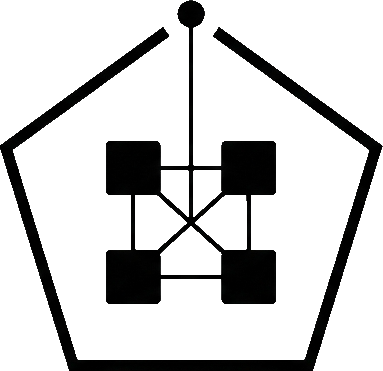
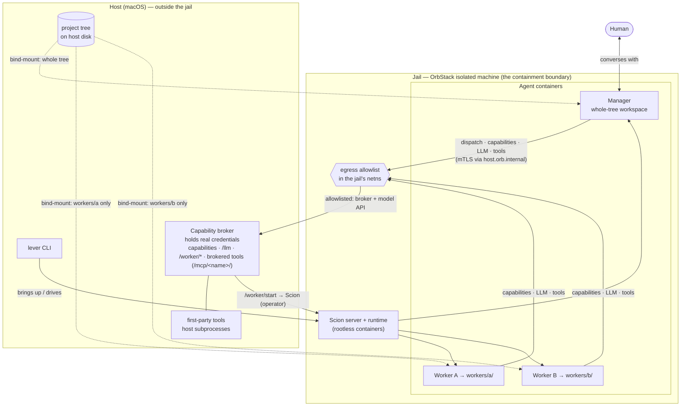

<p align="center">
  
</p>

# Lever

Homepage: **[lever.to](https://lever.to)**

**Containerised, jailed multi-agent orchestration.** A single *manager* agent drives a fleet of
*worker* agents, each in its own container, and the whole stack runs inside a **jail** so that a
compromised or prompt-injected agent cannot read host secrets or reach your local network.

Lever is the orchestration and interface layer; [Scion](https://github.com/GoogleCloudPlatform/scion)
is the runtime engine underneath (containers, sessions, attach/resume, typed messaging). You talk to
one tool, `lever`, and it drives Scion.

The threat model assumes the agent is hostile and lets the OS contain it: the bound is a single
directory subtree and an allowlist of network endpoints, enforced by the operating system, not by
the agent behaving. What that bound does and does not cover (e.g. data exfiltration over allowed
internet egress) is in the [security model](docs-site/_guides/security-model.md).

## The model

A **project is a directory.** You register a directory with Lever and every agent working on it
gets that directory bind-mounted in place; no clones, no sync. The **manager**'s workspace is the
whole tree; each **worker** is confined to its own subdirectory, isolated from the manager and from
its siblings. The manager dispatches work to workers, watches a typed event stream for progress and
questions, and is the single thing a human talks to.


```mermaid
graph TB
    Hu([Human])

    subgraph host["Host (macOS) — outside the jail"]
        CLI[lever CLI]
        BK["Capability broker<br/>holds real credentials<br/>capabilities · /llm · /worker/* · brokered tools (/mcp/&lt;name&gt;/)"]
        TOOLS[first-party tools<br/>host subprocesses]
        TREE[("project tree<br/>on host disk")]
    end

    subgraph jail["Jail — OrbStack isolated machine (the containment boundary)"]
        HUB["Scion server + runtime<br/>(rootless containers)"]
        FW{{egress allowlist<br/>in the jail's netns}}
        subgraph cons["Agent containers"]
            CO["Manager<br/>whole-tree workspace"]
            GA["Worker A → workers/a/"]
            GB["Worker B → workers/b/"]
        end
    end

    Hu <-->|converses with| CO
    CLI -->|brings up / drives| HUB
    CO -->|"dispatch · capabilities · LLM · tools<br/>(mTLS via host.orb.internal)"| FW
    GA -->|capabilities · LLM · tools| FW
    GB -->|capabilities · LLM · tools| FW
    FW -->|"allowlisted: broker + model API"| BK
    BK --- TOOLS
    BK -->|"/worker/start → Scion (operator)"| HUB
    HUB --> CO
    HUB --> GA
    HUB --> GB
    TREE -.->|"bind-mount: whole tree"| CO
    TREE -.->|"bind-mount: workers/a only"| GA
    TREE -.->|"bind-mount: workers/b only"| GB
```

## How it stays contained

The runtime and every agent run inside **one jail**: an [OrbStack](https://orbstack.dev) *isolated
machine* (or a Lima VM) that shares none of the host's files and has its own network namespace. The
`lever` binary and the **capability broker** (which holds the real credentials) run on the host;
Scion's server, the container runtime, and all agents run inside the jail as rootless containers.
The jail mounts only the project tree you choose and cannot route to the LAN; only an explicit
allowlist of host ports and the model API is reachable. No fork of Scion is required; containment
is enforced from outside it.

The jail is a contract, not one product. OrbStack and `lima` implement it. See [containment backends](docs-site/_reference/backends.md) and the
[security model](docs-site/_guides/security-model.md).

## Core + instance

`lever.to` ships the **generic core**: the orchestration engine, the manager role, jail
provisioning, the project model, and these docs. Your own setup is an **instance** built on top
(knowledge base, tools, workers, the manager's prompt/skills), consuming the `lever` binary as a
dependency. See [core vs instance](docs-site/_guides/core-vs-instance.md).

## Build & run

```bash
go install github.com/stevegeek/lever/cmd/lever@latest   # host `lever` onto your GOBIN/PATH
# — or from a clone (requires Go 1.26+):
make install              # build host `lever` → ~/.local/bin/lever (must be on PATH)
make lever-image          # build the agent image scionlocal/lever-claude:<arch>

cd path/to/my-instance && lever up        # bring up jail + scion + manager, attach the manager TTY
lever up path/to/my-instance/lever.yaml   # or pass an explicit config path
lever apply                               # headless; --dry-run prints the plan only
```

Runnable examples: [hello-worker](examples/hello-worker), [assistant-demo](examples/assistant-demo),
[multi-project](examples/multi-project), [two-agents-comms](examples/two-agents-comms).

Build prerequisites for the agent image (scion's base image, arch tags, extending the image for an
instance) are in [install & build the image](docs-site/_guides/getting-started-install.md).
Repository layout, binaries, and test targets are in [CONTRIBUTING.md](CONTRIBUTING.md).

An **instance** is one `lever.yaml` at the instance **root** describing the manager and its workers.
The root is not mounted; only the `tree:` subdirectory is bind-mounted into the jail. Commands with
no config argument read `./lever.yaml` from the current directory; there is no walk-up discovery.
See [config reference](docs-site/_reference/config.md) for every key.

## Commands

The everyday surface: `lever up` (bring up and attach), `lever apply` (headless), `lever attach`,
`lever msg send`, `lever reload` (apply config changes to a running instance), `lever stop`,
`lever destroy`, `lever init` (scaffold operator skills), `lever doctor`. Inside the manager
container, `lever-manager agent|msg|watch` dispatches and steers workers through the broker. Every
command and flag is in the [CLI reference](docs-site/_reference/cli.md).

## Requirements

- macOS on Apple Silicon with [OrbStack](https://orbstack.dev), or [Lima](https://lima-vm.io) ≥ 2.0.0
  (macOS or Linux). See [containment backends](docs-site/_reference/backends.md).
- [Scion](https://github.com/GoogleCloudPlatform/scion) as the runtime engine, pinned in `lever.yaml`
  (the examples pin a supported commit). A Go toolchain on the host with
  `scion.version:`/`scion.source:`; none with `scion.binary:`. See [config reference](docs-site/_reference/config.md#scion).
- Docker, to build the agent image locally.
- An LLM coding-agent harness (the agent image bakes Claude Code).

## Documentation

- [Getting started](docs-site/_guides/getting-started.md), build and run a working instance from scratch.
- [Config reference](docs-site/_reference/config.md), every `lever.yaml` key, defaults, and conventions.
- [CLI reference](docs-site/_reference/cli.md), every host and in-jail command.
- [Architecture](docs-site/_guides/architecture.md), topology, components, the dispatch/notification loop, the project model.
- [Security model](docs-site/_guides/security-model.md), threat model, the jail, what containment does and does not buy, validation evidence.
- [Containment backends](docs-site/_reference/backends.md), the jail contract and what OrbStack and Lima each guarantee.
- [Capabilities](docs-site/_guides/capabilities.md), how agents get authority.
- [Agent identity](docs-site/_guides/agent-identity.md), certificates, enrolment, renewal.
- [Core vs instance](docs-site/_guides/core-vs-instance.md), the boundary between the framework and your setup.
- [Conventions](docs-site/_guides/conventions.md), recommended (not enforced) tree patterns.
- [Operations](docs-site/_guides/operations.md), recipes for running an instance day to day.
- [Remote access](docs-site/_guides/remote-access.md), the tailnet proxy to the manager.
- [Operator directives](docs-site/_guides/operator-directives.md), authenticated directives to running agents.

## Licence

[MIT](LICENSE) © Stephen Ierodiaconou.
