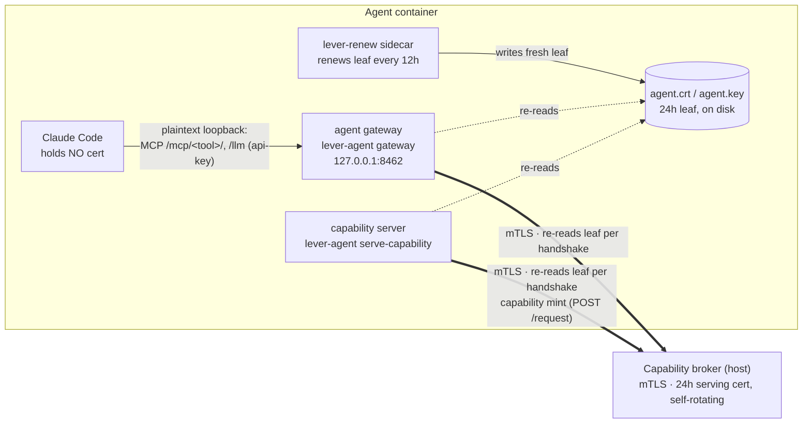

# Agent identity & certificates

Every call an agent makes to the capability broker — minting a capability, calling a brokered
tool, hitting `/llm` in api-key mode, sending or polling messages — is **mTLS, authenticated by
the agent's own certificate**. That certificate is the identity every capability token is bound to
([security-model §6](/security-model/credentials/)), and it is deliberately **not** a long-lived
credential: it is a **24h leaf**, and the short life is a security property — it bounds the
exposure window of a leaked agent key to a day, backstopping the per-call epoch + revocation that
is the real cut ([§6.2](/security-model/credentials/)). A long session therefore depends on the
renewal machinery described here.

## Enrolment (once, at first boot)

The agent generates a keypair **inside its container** — the private key never leaves it — and
redeems a **single-use enrolment ticket** at the broker's `/enrol`. The broker burns the ticket on
redeem and binds it to the CSR's CN, so a leaked ticket cannot be replayed or used to mint a
different identity. (The manager's ticket comes from the once-per-broker-process `/bootstrap`
latch; a worker's from the manager-gated `/provision`.) The broker's CA signs a **leaf
certificate** (`internal/cap/ca/issue.go`), written to `<id-dir>/agent.{crt,key}`. The leaf's CN
is the agent's identity; every capability the broker mints is bound to it.

## Renewal

The 24h leaf TTL bounds the damage of a leaked key, but requires the leaf to be continuously
renewed and re-read:

- **`lever-renew`**, a sidecar in the container, renews the leaf every **12h**, rewriting
  `agent.{crt,key}` on disk in place.
- **The broker's own serving cert** has the same 24h TTL and self-rotates in-process, re-minting
  when under 6h of validity remain (`internal/cap/ca/rotate.go`).
- **Invariant: every long-lived broker client must re-read the leaf per TLS handshake.** A process
  that reads the leaf once at boot and caches it keeps presenting the boot cert, which expires at
  24h even though a fresh leaf is on disk beside it. One-shot CLI calls may load it once; daemons
  must reload.

Getting the invariant wrong is a **silent availability failure that masquerades as the broker
being down**: a client that froze its boot leaf keeps authenticating fine for 24h, then fails
*every* broker handshake at once — and since each brokered tool call mints a capability first, all
brokered tools appear to fail together while the broker itself stays healthy.

## The two long-lived clients

Two long-lived clients run in every agent container, and both obey the invariant:





- **The agent gateway** (`lever-agent gateway`, loopback `127.0.0.1:8462`) exists because Claude
  Code reads a client cert **once at process start and caches it for its whole lifetime**, so it
  cannot follow a rotating leaf. Instead Claude holds no cert: its MCP tool calls
  (`--transport http …/mcp/<tool>/`) and, in api-key mode, its `ANTHROPIC_BASE_URL` (`…/llm`)
  point at this **plaintext loopback proxy**, which presents the current leaf to the broker over
  mTLS.
- **The capability server** (`lever-agent serve-capability`) is a stdio MCP subprocess that mints
  capability tokens against the broker's `/request` — a *second, direct* mTLS client, not routed
  through the gateway. It re-reads the leaf per handshake via `agent.NewReloadingClient` (the same
  cert-source machinery the gateway uses). Every brokered tool call mints a capability first, so a
  stale cert here would take every brokered tool down at the 24h mark while the broker itself
  stayed healthy.

Pooled broker connections are capped at **5 minutes idle**, so a rotated leaf reaches the broker
long before the old one expires. (TLS validates certificates at handshake only; an established,
busy connection keeps working.)
