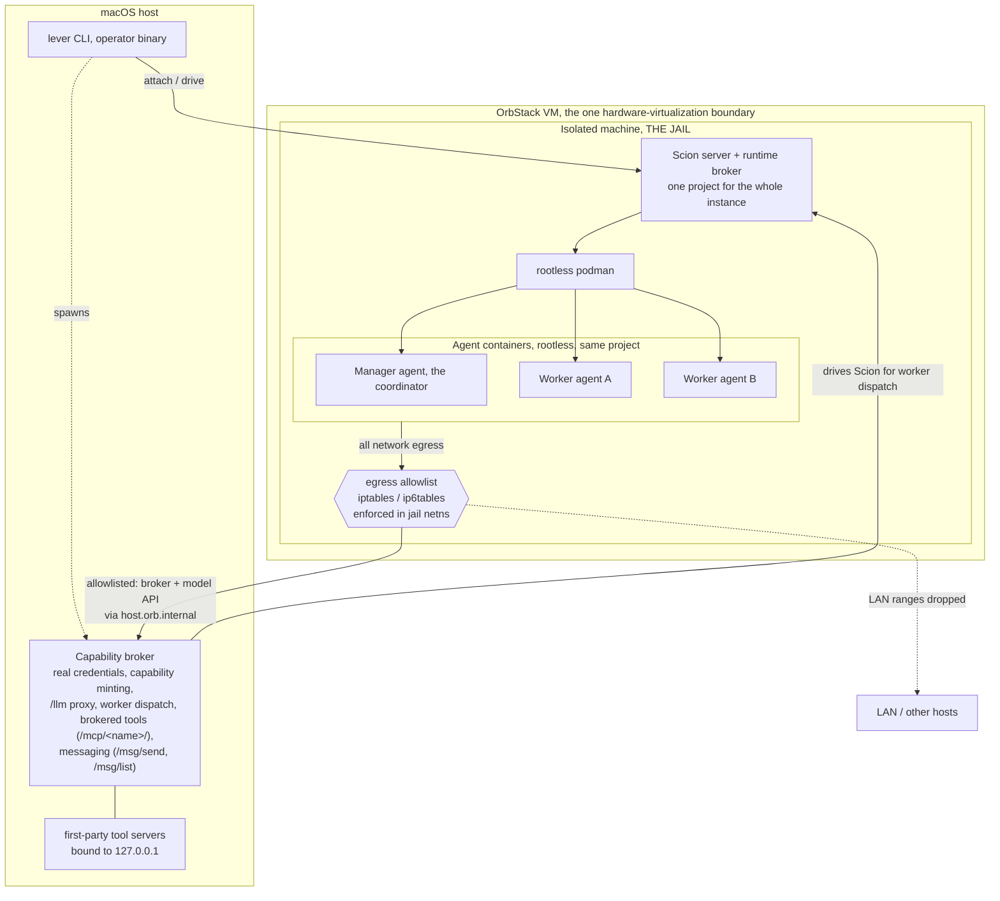
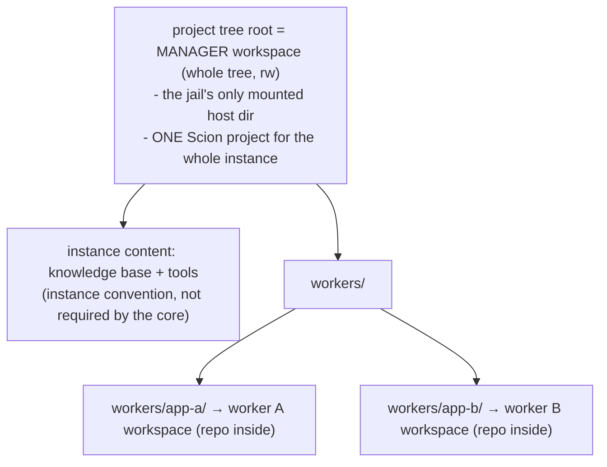
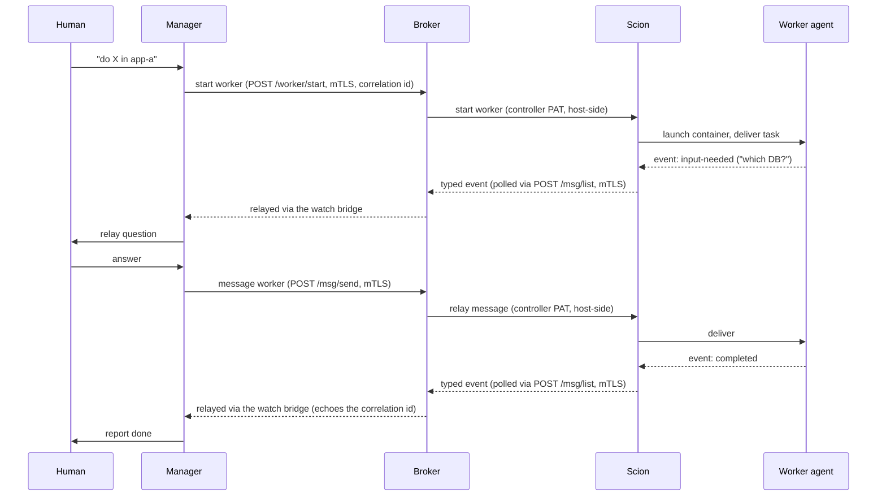

# Architecture

> **Mostly built.** Jail bring-up, the manager up/attach lifecycle, the capability broker, worker
> dispatch (the manager calling the broker's `/worker/*` endpoints), broker-routed messaging
> (`/msg/send`, `/msg/list`), and the `lever-manager watch` bridge are implemented and validated (see
> [security-model.md](/security-model/)). The notification contract in
> §4 (the `input-needed`/`completed` event names) is still being refined; treat those event names as
> illustrative, not literal identifiers.

Lever is a thin orchestration-and-interface layer over [Scion](https://github.com/GoogleCloudPlatform/scion),
which provides the container runtime, agent sessions, attach/resume, and typed messaging. Two Scion
terms recur below: the **Scion broker** (Scion's host-side component that asks the container runtime to
create containers and apply mounts) and the **hub** (Scion's registry of projects and agents). Lever
adds four things Scion does not: an **opinionated project model** (a project is a directory), a
**security jail** that contains the whole runtime, a **capability broker** (Lever's own host-side
credential and tool-access broker, distinct from the Scion broker above), and a **single operator
surface** (`lever`).

## 1. Layers





- **The OrbStack VM is the only hardware-virtualization boundary.** The jail (an OrbStack
  *isolated machine*) and the containers inside it are kernel namespaces, so nesting adds no
  per-level CPU cost. With the `orbstack`/`lima` backends a single kernel is shared across the
  manager and all workers — a security trade noted in [security-model.md §8](/security-model/compromise/);
  the `apple-container` backend gives each agent its own VM kernel.
- **The jail is the containment boundary**, not Scion. The egress allowlist is enforced in the
  jail's network namespace, outside the agent containers.
- **OrbStack is the reference *backend*, not a hard dependency.** The jail is a contract: a
  hypervisor boundary, no host files, a controllable netns with egress enforced in it, a
  host-reachable broker. OrbStack is one implementation; `lima` (macOS/Linux, its own VM kernel)
  is the second; `apple-container` (per-agent micro-VM) is on the roadmap. Each backend declares
  its own guarantees — run `lever backends` or see [containment backends](/reference/backends/).
  **Docker Desktop is not a backend** (its shared VM auto-mounts your home and its netns is not
  controllable), and a native no-VM `linux-docker` backend was rejected for sharing the host
  kernel outright; the backends page has both writeups.

## 2. The project model: a project is a directory

A Lever **instance is one Scion project**, registered once at the tree root (a non-git "linked"
project — Scion's `.scion` marker is externalized, not committed into the tree). The manager and
every worker are **agents inside that single project**. Each agent is bound to an explicit,
in-place workspace via `--workspace`: the manager's workspace is the whole tree root; a worker's
is one subdirectory of it. There are no clones, no git worktrees, and no sync loop — an agent
edits the real files. A worker's subdirectory may itself contain a git repository (to the runtime
it is just files), but the **tree root itself must be non-git**, see below.





- **Manager** — workspace is the whole tree root: the instance's knowledge base and tools, plus a
  live view of every worker.
- **Workers** — each an agent in the *same* project, bound to its own subdirectory. Isolation
  between workers is **"defense by absence"**: a worker's container bind-mounts only its own
  configured subdirectory, so a sibling's directory is never a mount source for it — not merely
  hidden by convention. This holds only on a **non-git tree root** (config validation enforces it
  at load time, and the pinned Scion plain-mounts an explicit `--workspace` even under a stray
  ancestor `.git`); see [security-model.md §4](/security-model/worker-isolation/) for the full guarantee and its
  residual.
- **The manager's mounts overlap the workers' by design** — its workspace physically contains
  every worker directory, so edits are live to all parties. File-level isolation between the
  manager and a worker's subdirectory is convention, not enforcement: the manager is trusted with
  whole-tree oversight. This is not an access control against a hostile *worker* — a worker cannot
  reach outside its own subdirectory at all (previous bullet). The *dispatch* boundary is enforced
  separately: the manager can start only workers declared in the config, and only via the broker
  ([security-model.md §5.4](/security-model/config-trust/)).
- The core requires only a tree root plus configured worker subdirectories; the `knowledge base +
  tools` layout and the `workers/` nesting above are instance conventions.

**Scion's git mode is never used.** Git-anchored project mode triggers a clone per agent and its
shared-worktree path is unreliable; more fundamentally, a git tree root would defeat the
defense-by-absence guarantee above. Config validation enforces a non-git tree root.

## 3. Components

| Component | Role | Core or instance |
|---|---|---|
| `lever` (Go binary) | operator CLI + entry point; drives Scion; provisions the jail | **core** (runs on host) |
| Scion server + Scion broker | container lifecycle, sessions, attach/resume, typed messaging | core (runs inside the jail) |
| rootless podman | the container runtime the Scion broker drives (rootless, see security-model.md) | core (inside the jail) |
| Lever capability broker | host-side: holds the real model key, mints CN-bound capability tokens, proxies `/llm` and gated MCP tool calls, relays typed agent messaging (`/msg/send`, `/msg/list`), and runs the [operator-directive](/operator-directives/) channel (a 0600 UDS admin socket + agent-facing `directive_consume` over mTLS; see [security-model](/security-model/operator-directives/)) | **core** (runs on host) |
| Manager **runtime/role** | the coordinator: a singleton agent with the whole-tree workspace that dispatches work and watches events | **core role** |
| Manager **prompt / skills / tool (MCP) config** | what makes it *this* manager | **instance-supplied config** |
| Worker agents | agents in the instance's one Scion project, each bound to its own subdirectory workspace; isolated from siblings by defense-by-absence (§2), not a separate project | core lifecycle; instance defines the workers |
| Agent base image | the coding-agent harness container | **core ships a generic minimal base; the instance extends/bakes its own** (see §6) |
| Notification bridge | turns Scion's event stream into a file/sink the operator watches | core mechanism; **sink path is instance-configured** |

The core knows the *manager* as a first-class role (singleton, whole-tree workspace, event-watcher),
but everything that makes it a *particular* manager, its boot prompt, its skills, which tool/MCP
ports it may reach, is configuration the instance supplies.

## 4. The dispatch / notification loop

The manager dispatches a unit of work to a worker and then watches a typed event stream rather than
polling. Two event types matter most: `input-needed` (the worker is blocked on a decision) and a
terminal `completed`.





Messaging follows the same broker-mediated shape as dispatch: `lever-manager msg send`/`msg
list`/`watch` are thin mTLS clients of the broker's `/msg/send` and `/msg/list`, never of Scion
directly. An in-container `scion` CLI call has no hub credential to authenticate with — the hub
runs with dev-auth off, and only the host-side broker holds the controller PAT (see
[security-model.md §4](/security-model/worker-isolation/)) — so only the broker can address an arbitrary agent's
inbox.

**The task ↔ agent contract.** The core knows nothing about an instance's task records. At dispatch
the instance supplies an opaque **correlation id**; the core echoes that id on lifecycle events
(notably `completed`). The instance maps the id back to its own record and decides what "close the
task" means. So the live agent stream tells you *how it's going*; the instance's records remain the
authority on *what* and *whether done*.

## 5. Entry point

`lever` is the single command an operator runs on the host. It:

1. Ensures the jail (isolated machine) is up, with rootless podman, the Scion server/broker, and
   the egress allowlist applied.
2. Ensures the manager agent is up, resuming the prior conversation if it was suspended, creating
   it if absent, attaching if already running.
3. Hands the terminal to the manager session (the Scion server/broker run inside the jail; `lever`
   attaches in from the host). On detach, the manager is left **suspended** so the next `lever`
   resumes the same conversation.

(How much of the attach/tmux UX is generic core vs instance presentation is still being decided.)

Three lifecycle verbs, at increasing cost:

- **detach** (`Ctrl-b d`) — leave the TTY. The manager stays suspended in memory; the jail machine
  keeps running.
- **`lever stop`** — suspend the manager (best-effort), stop the host broker, power the jail
  machine off. Disk and session are preserved; `lever up` powers back on and resumes the same
  conversation.
- **`lever destroy`** — delete the jail machine and clear staged runtime state; `lever up` fully
  re-provisions. (`lever down` is a deprecated alias.)

## 6. Agent image & runtime provisioning

The **core ships a generic, minimal base image** carrying only the coding-agent harness;
it is deliberately language-agnostic. An **instance extends it** (or bakes its own) for whatever
its workers need. Two patterns, both instance choices:

- **Per-worker on demand:** agents install language runtimes inside their containers as needed (a
  Ruby version manager, Node, Python). Keeps the image small; pays a cold-start.
- **Baked:** the instance builds an image with its common runtimes pre-installed. Faster start; less
  generic. (The reference instance bakes a default toolchain, an *instance* artifact, not part of
  the core.)

**Images are tagged by architecture.** Agent images carry an arch tag
(`scionlocal/lever-claude:arm64` / `:amd64`), never a shared `:latest`, so a host that cross-builds
both — an arm64 laptop producing an amd64 server image — never clobbers one arch with the other. A
**tagless** `manager.image` in the config auto-resolves to the jail's arch at apply time (the jail's
arch equals its host's), so **one config is portable** across an arm64 laptop and an amd64 server; an
explicitly-tagged or digest-pinned ref is honored verbatim as an escape hatch. `make lever-image
LEVER_IMAGE_ARCH=<arch>` builds `FROM scion-claude:<arch>` and tags the output to match.

**Filesystem performance note:** compute nesting is near-native, but files served from the host via
the project-tree mount cross OrbStack's virtiofs, which is slow for metadata-heavy operations (large
dependency installs). A worker that runs its *own* Docker compounds overlay filesystems; prefer
sibling containers (sharing the jail's rootless podman) over a nested daemon. See
[security-model.md §2.3](/security-model/jail/) for the rootless requirement.

## 7. Agent identity & the cert path

Every call an agent makes to the capability broker is mTLS, authenticated by a short-lived (24h)
per-agent certificate whose CN every capability token is bound to. Enrolment, the renewal
sidecars, the per-handshake re-read invariant, and the two long-lived in-container clients (the
agent gateway and the capability server) are described in
[Agent identity & certificates](/agent-identity/).
