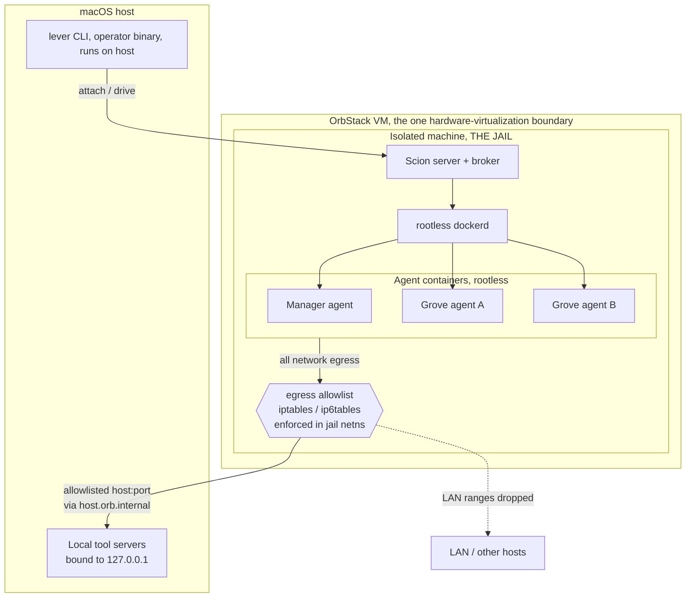
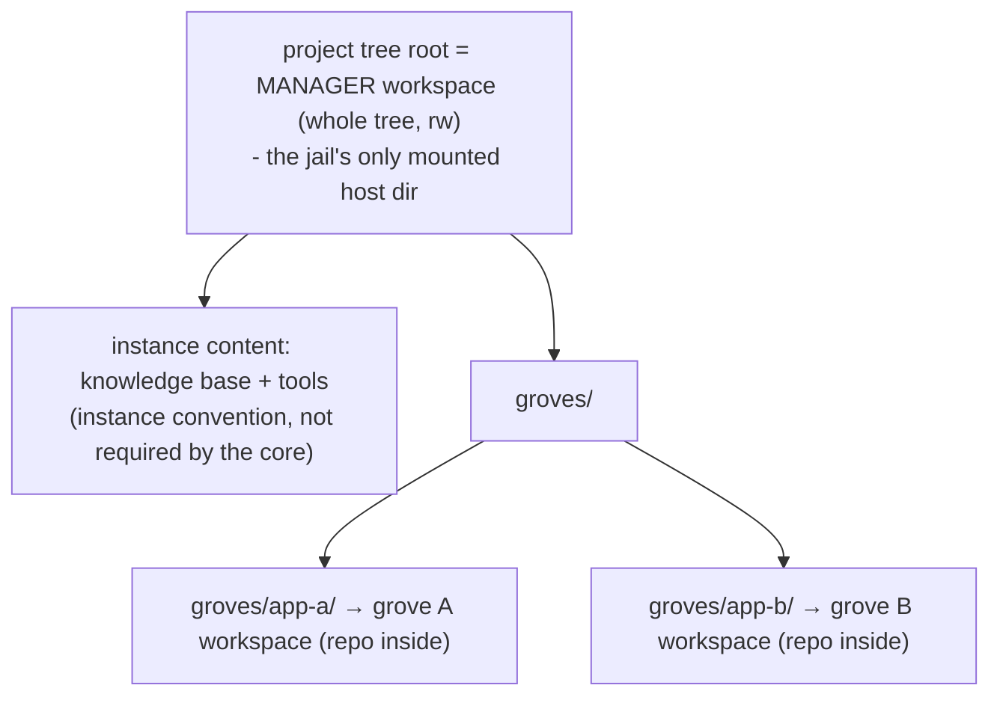
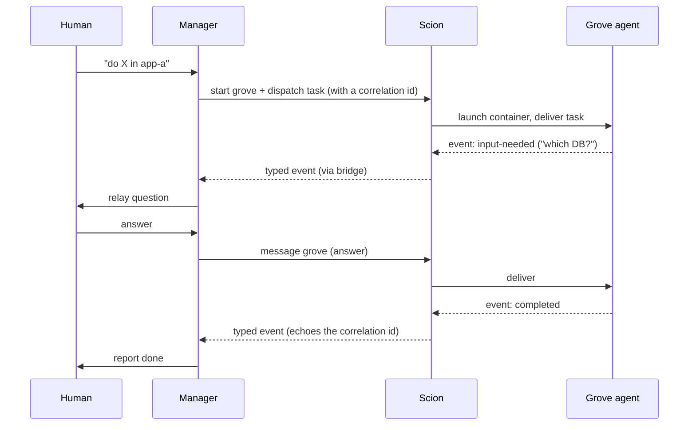

# Architecture

> **Mostly built; §4 is design intent.** Jail bring-up, the manager up/attach lifecycle, the
> capability broker, and the `lever watch` bridge are implemented and validated (see
> [security-model.md](/security-model/)). The dispatch and notification loop in §4 (the
> `input-needed`/`completed` event contract) is not yet wired end-to-end; treat that section as
> design intent and its event names as illustrative, not literal identifiers.

Lever is a thin orchestration-and-interface layer over [Scion](https://github.com/GoogleCloudPlatform/scion),
which provides the container runtime, agent sessions, attach/resume, and typed messaging. Two Scion
terms recur below: the **Scion broker** (Scion's host-side component that asks the container runtime to
create containers and apply mounts) and the **hub** (Scion's registry of projects and agents). Lever
adds four things Scion does not: an **opinionated project model** (a project is a directory), a
**security jail** that contains the whole runtime, a **capability broker** (Lever's own host-side
credential and tool-access broker, distinct from the Scion broker above), and a **single operator
surface** (`lever`).

## 1. Layers





- **Only the OrbStack VM is a hardware-virtualization boundary**, you already run it for all Docker
  use. The jail (an OrbStack *isolated machine*) and every container below it are kernel namespaces,
  so there is effectively no per-level CPU tax; nesting is cheap. (This also means a *single* kernel
  is shared across the manager and all groves, a security trade noted in
  [security-model.md §5](/security-model/).)
- **The jail is the containment boundary**, not Scion. The egress allowlist is enforced in the
  jail's network namespace, outside the agent containers.

## 2. The project model: a project is a directory

A Lever project is registered by pointing Scion at a directory (a non-git "linked" project). Every
agent of that project gets the directory **bind-mounted in place, read-write**, as its workspace.
There are no clones, no git worktrees, and no sync loop, an agent edits the real files, exactly as
a human in that directory would. Git repositories may live *inside* a project directory; the
runtime neither knows nor cares (a git repo is just files).





- **Manager project**, workspace is the whole tree root, so the manager sees everything the
  instance keeps there (its knowledge base, tools) and a live view of every grove.
- **Grove projects**, each `groves/<name>/` is its own project, isolated from the manager and
  from siblings. A grove agent sees only its own directory.
- **Overlapping mounts are intentional**, the manager's workspace physically contains the grove
  directories, so edits are live to all parties. Note this is a single writable tree: isolation
  *between* the manager and groves currently rests on convention, not enforcement, and is hardened
  by the planned inner auth layer ([security-model.md §4](/security-model/)). It is **not** a
  security control against a hostile grove today.
- The core only requires a tree root plus a configured grove location; the `knowledge base + tools`
  layout above is an *instance* convention.

**Git mode is never used.** Scion's git-anchored project mode triggers a clone per agent and the
shared-worktree path is unreliable; the directory model sidesteps all of it.

## 3. Components

| Component | Role | Core or instance |
|---|---|---|
| `lever` (Go binary) | operator CLI + entry point; drives Scion; provisions the jail | **core** (runs on host) |
| Scion server + Scion broker | container lifecycle, sessions, attach/resume, typed messaging | core (runs inside the jail) |
| rootless dockerd | the container runtime the Scion broker drives (rootless, see security-model.md) | core (inside the jail) |
| Lever capability broker | host-side: holds the real model key, mints CN-bound capability tokens, proxies `/llm` and gated MCP tool calls | **core** (runs on host) |
| Manager **runtime/role** | the brain: a singleton agent with the whole-tree workspace that dispatches work and watches events | **core role** |
| Manager **prompt / skills / tool (MCP) config** | what makes it *this* manager | **instance-supplied config** |
| Grove agents | workers; one project each; isolated | core lifecycle; instance defines the groves |
| Agent base image | the coding-agent harness container | **core ships a generic minimal base; the instance extends/bakes its own** (see §6) |
| Notification bridge | turns Scion's event stream into a file/sink the operator watches | core mechanism; **sink path is instance-configured** |

The core knows the *manager* as a first-class role (singleton, whole-tree workspace, event-watcher),
but everything that makes it a *particular* manager, its boot prompt, its skills, which tool/MCP
ports it may reach, is configuration the instance supplies.

## 4. The dispatch / notification loop

The manager dispatches a unit of work to a grove and then watches a typed event stream rather than
polling. Two event types matter most: `input-needed` (the grove is blocked on a decision) and a
terminal `completed`.





**The task ↔ agent contract.** The core knows nothing about an instance's task records. At dispatch
the instance supplies an opaque **correlation id**; the core echoes that id on lifecycle events
(notably `completed`). The instance maps the id back to its own record and decides what "close the
task" means. So the live agent stream tells you *how it's going*; the instance's records remain the
authority on *what* and *whether done*.

## 5. Entry point

`lever` is the single command an operator runs on the host. It:

1. Ensures the jail (isolated machine) is up, with rootless Docker, the Scion server/broker, and
   the egress allowlist applied.
2. Ensures the manager agent is up, resuming the prior conversation if it was suspended, creating
   it if absent, attaching if already running.
3. Hands the terminal to the manager session (the Scion server/broker run inside the jail; `lever`
   attaches in from the host). On detach, the manager is left **suspended** so the next `lever`
   resumes the same conversation.

(How much of the attach/tmux UX is generic core vs instance presentation is still being decided.)

## 6. Agent image & runtime provisioning

The **core ships a generic, minimal base image** carrying only the coding-agent harness, it is
deliberately language-agnostic. An **instance extends it** (or bakes its own) for whatever its
groves need. Two patterns, both instance choices:

- **Per-grove on demand:** agents install language runtimes inside their containers as needed (a
  Ruby version manager, Node, Python). Keeps the image small; pays a cold-start.
- **Baked:** the instance builds an image with its common runtimes pre-installed. Faster start; less
  generic. (The reference instance bakes a default toolchain, an *instance* artifact, not part of
  the core.)

**Filesystem performance note:** compute nesting is near-native, but files served from the host via
the project-tree mount cross OrbStack's virtiofs, which is slow for metadata-heavy operations (large
dependency installs). A grove that runs its *own* Docker compounds overlay filesystems; prefer
sibling containers (sharing the jail's rootless daemon) over a nested daemon. See
[security-model.md §2.3](/security-model/) for the rootless requirement.
