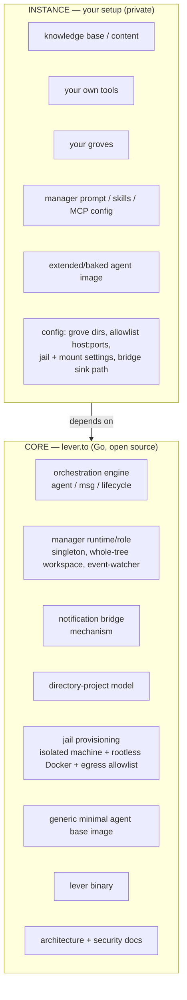

# Core vs instance

Lever is split so that the reusable framework and a particular person's setup never tangle.

- The **core** (`lever.to`) is the generic, open-source framework: the orchestration engine, the
  manager *runtime/role*, the security jail, the project model, the `lever` binary, and the docs.
- An **instance** is a private setup built *on top of* the core: a knowledge base, personal or
  domain-specific tools, the actual groves, and the configuration that makes the manager *this*
  manager. An instance depends on the `lever` binary; it does not vendor or fork it.

The framework authors run their own personal assistant as the first instance — dogfooding the core
so the abstraction is proven by real use, not just asserted.





(The instance feeds the core through configuration — grove locations and the manager's
prompt/skills/MCP go to the engine and manager role; allowlist ports, mount root, and jail settings
go to jail provisioning; the bridge sink path tells the notification bridge where to write. The
single "depends on" arrow stands in for all of these; the config contract is sketched below and
designed in detail alongside the Go core.)

## What lives where

| Area | Core (`lever.to`) | Instance (yours) |
|---|---|---|
| Orchestration | engine, manager runtime/role, notification bridge mechanism, directory-project model | — |
| Manager identity | the *role* (singleton, whole-tree workspace, watches events) | its **prompt, skills, and tool/MCP config** |
| Agent image | a generic, minimal harness base image | the **extended/baked image** its groves need |
| Security / jail | jail provisioning + egress-allowlist mechanism | the allowlist **values** (your tool ports), mount root, jail settings |
| Entry point | the `lever` binary | a thin personal CLI that delegates orchestration to `lever` |
| Notification bridge | the mechanism (event stream → sink) | the **sink path** + what consumes it |
| Conventions | documented patterns (see below), not enforced code | how you actually organise your tree |
| Tools | none — the core ships no personal tools | your own (task tracking, content, domain logic, …) |
| Knowledge base | none | all of it |

## The boundary rules

- **The core ships no personal tools.** Task trackers, content systems, accounting, domain logic —
  all instance. The core knows how to *orchestrate agents*, nothing about your subject matter.
- **The manager is a core role with instance config.** The core provides the manager's lifecycle and
  privileges (singleton, whole-tree workspace, event-watching); the instance supplies its boot
  prompt, skills, and which tool/MCP ports it may reach. The core encodes the *pattern*; the
  instance fills the slots.
- **The agent image is core-base + instance-extension.** The core ships a generic minimal harness
  image; the instance extends or bakes its own for the languages its groves use. Whether to bake
  runtimes or install them per-grove on demand is an instance choice the core does not mandate.
- **Conventions are documentation, not code.** Lever recommends a way to organise a tree (groves;
  optionally areas/projects/goals/archive), but the core does not force it. See
  [conventions.md](/conventions/).
- **The instance declares itself to the core via config**, so the core stays instance-agnostic. The
  config format is **designed-not-built** (it lands with the Go core), but its required keys are
  already clear:
  - the **tree root** and the **grove directories** (or a glob);
  - the **egress allowlist** (`host:port`s) and any LAN/jail settings + the **mount root**;
  - the **manager**: boot prompt, skills directory, MCP/tool config;
  - the **agent image** reference;
  - the **notification sink path** for the bridge.
- **The "task ↔ agent" contract is shared plumbing, by correlation id.** The core knows nothing about
  "to-dos"; at dispatch the instance passes an opaque correlation id, the core echoes it on lifecycle
  events (e.g. `completed`), and the instance maps it back to its own record and decides what closing
  it means.

## Building an instance (the intended shape)

1. Install the `lever` binary and its runtime prerequisites (Scion, OrbStack). *(Nothing is
   installable yet — see the README status.)*
2. Create a project tree: a top-level directory (your knowledge base + tools) with a `groves/`
   subdirectory for the projects agents will work on.
3. Write an instance config (the keys above): your groves, your tool/MCP ports to allowlist, jail
   settings, the manager's prompt + skills, your agent image, and the bridge sink path.
4. Run `lever` — it provisions the jail, brings up the manager on your tree, and hands you the
   session.
5. Add your own tools and knowledge base inside the tree. Anything agent-related calls the `lever`
   binary; everything else is yours.

## Why dogfooding

The strongest test of a framework boundary is whether its own author can build a real, demanding
system on it without reaching across the line. By running a full personal assistant as instance #1,
every leak in the abstraction — every place the core had to know something instance-specific —
shows up immediately and gets pushed back across the boundary.
