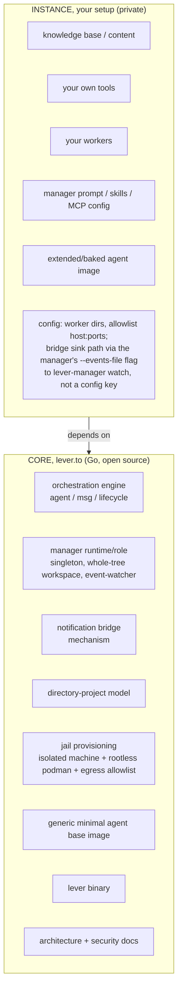

# Core vs instance

Lever separates the reusable framework from a particular operator's setup.

- The **core** (`lever.to`) is the generic, open-source framework: the orchestration engine, the
  manager *runtime/role*, the security jail, the project model, the `lever` binary, and the docs.
- An **instance** is a private setup built *on top of* the core: a knowledge base, personal or
  domain-specific tools, the actual workers, and the configuration that makes the manager *this*
  manager. An instance depends on the `lever` binary and does not fork it (it may bake the
  core-built in-jail binaries into its own agent image via `make lever-image-bins`, but never forks
  the core itself).

The reference instance is the authors' personal assistant.



```mermaid
graph TD
    subgraph core["CORE, lever.to (Go, open source)"]
        ENG[orchestration engine<br/>agent / msg / lifecycle]
        MGR[manager runtime/role<br/>singleton, whole-tree workspace, event-watcher]
        BR[notification bridge<br/>mechanism]
        PM[directory-project model]
        JAIL[jail provisioning<br/>isolated machine + rootless podman + egress allowlist]
        IMG[generic minimal agent base image]
        BIN[lever binary]
        DOCS[architecture + security docs]
    end
    subgraph inst["INSTANCE, your setup (private)"]
        KB[knowledge base / content]
        TOOLS[your own tools]
        WORKERS[your workers]
        MCFG[manager prompt / skills / MCP config]
        EXTIMG[extended/baked agent image]
        CFG[config: worker dirs, allowlist host:ports;<br/>bridge sink path via the manager's --events-file flag<br/>to lever-manager watch, not a config key]
    end
    inst -->|depends on| core
```


## What lives where

| Area | Core (`lever.to`) | Instance (yours) |
|---|---|---|
| Orchestration | engine, manager runtime/role, notification bridge mechanism, directory-project model | - |
| Manager identity | the *role* (singleton, whole-tree workspace, watches events) | its **prompt, skills, and tool/MCP config** |
| Agent image | a generic, minimal harness base image | the **extended/baked image** its workers need |
| Security / jail | jail provisioning + egress-allowlist mechanism | the allowlist **values** (your tool ports), mount root, jail settings |
| Entry point | the `lever` binary | a thin personal CLI that delegates orchestration to `lever` |
| Notification bridge | the mechanism (event stream → sink) | the **sink path** (the `--events-file` flag the manager passes to `lever-manager watch`, not a config key) + what consumes it |
| Conventions | documented patterns (see below), not enforced code | how you actually organise your tree |
| Tools | none, the core ships no personal tools | your own (task tracking, content, domain logic, …) |
| Knowledge base | none | all of it |

## The boundary rules

- **The core ships no personal tools.** Task trackers, content systems, accounting, domain logic,
  all instance. The core knows how to *orchestrate agents*, nothing about your subject matter.
- **The manager is a core role with instance config.** The core provides the manager's lifecycle and
  privileges (singleton, whole-tree workspace, event-watching); the instance supplies its boot
  prompt, skills, and which tool/MCP ports it may reach. The core encodes the *pattern*; the
  instance fills the slots.
- **The agent image is core-base + instance-extension.** The core ships a generic minimal harness
  image; the instance extends or bakes its own for the languages its workers use. Whether to bake
  runtimes or install them per-worker on demand is an instance choice the core does not mandate.
- **Conventions are documentation, not code.** Lever recommends a way to organise a tree (workers;
  optionally areas/projects/goals/archive), but the core does not force it. See
  [conventions.md](/conventions/).
- **The instance declares itself to the core via config**, so the core stays instance-agnostic.
  `lever.yaml` at the instance root carries the tree, manager, workers, broker, and optional
  engine/egress/security/operator/remote blocks; every key is in the
  [configuration reference](/reference/config/).
- **The task ↔ agent link is an instance convention.** The core carries no correlation id and
  tracks no tasks; the bridge relays agent messages verbatim. An instance that needs correlation
  instructs its workers to echo a task id in their messages and maps it back to its own records.

## Building an instance (the intended shape)

1. Build the `lever` binary and meet its runtime prerequisites; see
   [getting started](/getting-started/).
2. Create a project tree: a top-level directory (your knowledge base + tools) with a `workers/`
   subdirectory for the projects agents will work on.
3. Write an instance config: `tree`, `workers`, `manager.allow_ports`, `manager.prompt_file`,
   `manager.image`.
4. Run `lever`, it provisions the jail, brings up the manager on your tree, and hands you the
   session.
5. Add your own tools and knowledge base inside the tree. Anything agent-related calls the `lever`
   binary; everything else is yours.
